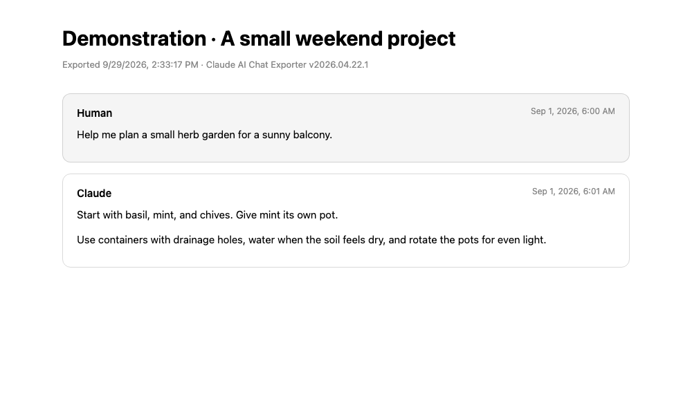

<div align="center">


# Claude AI Chat Exporter

**Keep a readable copy of the conversation. Choose the format that fits your next step.**

[](claude-ai-chat-exporter.user.js) [](#output-format) [](LICENSE)

[Install](#install) · [Choose a format](#choose-your-format) · [Preview](#export-preview) · [Troubleshooting](#troubleshooting) · [Roadmap](#roadmap)

</div>

A Tampermonkey / Violentmonkey / Greasemonkey userscript that exports Claude AI conversations from [claude.ai](https://claude.ai) to **Markdown**, **JSON**, or **HTML**.

Author: [sharmanhall](https://greasyfork.org/en/users/866731-sharmanhall). Mirrors and source live in this GitHub repo; the script is published on Greasy Fork at [claude-ai-chat-exporter](https://greasyfork.org/en/scripts/574914-claude-ai-chat-exporter).

## Choose your format

| Format | Use it for |
|---|---|
| **Markdown** | Notes and handoffs: readable headings with optional thinking, tools, and attachment text |
| **JSON** | Analysis: structured messages and raw metadata; inclusion toggles do not filter it |
| **HTML** | Browser reading: styled cards with light/dark support and a minimal renderer |

**HTML safety:** raw-content injection is tracked in [#9](https://github.com/tyhallcsu/claude-ai-chat-exporter/issues/9). Prefer JSON or Markdown viewed as plain text for untrusted conversations until this is fixed.

**One conversation at a time.** Exports follow the active branch of an owned chat, or the available shared-chat snapshot. This is not an account-wide backup or an original-attachment downloader.

## Install

- **Greasy Fork:** <https://greasyfork.org/en/scripts/574914-claude-ai-chat-exporter>
- **GitHub raw (direct):** [claude-ai-chat-exporter.user.js](https://github.com/tyhallcsu/claude-ai-chat-exporter/raw/main/claude-ai-chat-exporter.user.js)

**Recommended source for the current GitHub code:** [Install the userscript](https://github.com/tyhallcsu/claude-ai-chat-exporter/raw/main/claude-ai-chat-exporter.user.js). Check the version shown by your manager before replacing an existing install. The Greasy Fork listing may lag GitHub; publication parity is tracked in [#7](https://github.com/tyhallcsu/claude-ai-chat-exporter/issues/7).

Open either link in a browser with [Tampermonkey](https://www.tampermonkey.net/) (or Violentmonkey / Greasemonkey) installed and confirm the install prompt.

## Features

- **API-first extraction** — reads the conversation directly from Claude's internal API instead of clicking each copy button. This avoids one copy-button operation per message when the API path succeeds.
- **DOM fallback** — if the API call fails (auth change, new endpoint), falls back to the classic copy-button + clipboard interception flow (chat pages only; shared chats have no copy buttons).
- **Branched threads** — walks from the current leaf through `parent_message_uuid` so you get only the active thread, not every branch from edited messages.
- **Rich content types** — renders `text`, `thinking`, `tool_use`, `tool_result`, and attachments.
- **Three formats** — Markdown (default), JSON (full structured dump), HTML (standalone styled page).
- **Settings panel** — toggle thinking blocks, tool calls, attachments, timestamps, and clipboard-vs-download.
- **Keyboard shortcut** — `Alt+Shift+E` triggers an export with the current format.
- **Menu commands** — per-format export entries in the userscript manager menu.
- **Safe clipboard patching** — the DOM fallback always restores `navigator.clipboard.writeText` in `finally`, after the capture attempt, including when that attempt throws. This does not guarantee a complete fallback export.

## Usage

1. Open any conversation at `https://claude.ai/chat/<id>`. Shared chats at `https://claude.ai/share/<id>` are also supported when your signed-in account has access to them.
2. Click the **Export** button in the bottom-right corner, or press `Alt+Shift+E`.
3. Click the **⚙** gear to open the options panel and change format / toggles.

**Quick start:** install → reload Claude → open an owned or accessible shared conversation → choose options with **⚙** → click **Export**. Downloads are the default; clipboard output is optional.

Files use the conversation title and export date, such as `Weekend_plan_2026-09-29.md`. Review the saved file before sharing it, especially when the exporter reports a fallback.

## Export preview



**Demonstration:** this is HTML output from v2026.04.22.1, rendered from two synthetic messages. The sample is a format preview, not a current-version compatibility test. It is not a screenshot of a real Claude conversation. [Open the generated HTML source](assets/demo-export.html).

## Output format

### Markdown
````markdown
# My Conversation Title

- **Exported:** 2026-04-22T...
- **Exporter:** Claude AI Chat Exporter v2026.04.22.1
- **Source:** https://claude.ai/chat/...

---

## Human — Apr 22, 2026, 9:15 PM

Hello Claude...

---

## Claude — Apr 22, 2026, 9:15 PM

> **[thinking]**
>
> > The user is asking...

Here's my response.

**→ tool_use: `web_search`**

```json
{ "query": "..." }
```
````

### JSON
Full structured dump including message UUIDs, timestamps, and raw `content` parts — useful for downstream processing.

### HTML
Standalone single-file HTML page with light/dark styling.

## Options

| Option | Default | Description |
| --- | --- | --- |
| Format | Markdown | Output format |
| Include thinking blocks | ✅ | Extended thinking content |
| Include tool use / results | ✅ | `tool_use` and `tool_result` blocks |
| Include attachments | ✅ | Attachment names and available extracted text; no original-file download |
| Include timestamps | ✅ | Show `created_at` in message headings |
| Copy to clipboard | ❌ | Skip the download and copy the output instead |

Options persist across sessions via `GM_setValue`.

The thinking, tool, and attachment toggles affect Markdown and HTML rendering. **JSON retains the active thread's raw content and attachment fields even when those toggles are off.** Its structured timestamps are retained too.

## Limitations and privacy

- The API request uses your existing signed-in browser session on the current Claude origin. This script contains no external upload endpoint; output is downloaded locally or copied to the clipboard. Treat exported files as private conversation data.
- Claude's internal API, organization cookie, and page selectors may change. An API-first implementation is not a guarantee of compatibility with every current account or interface.
- The DOM fallback captures copyable messages present on the page. Unloaded messages and rich API metadata may be missing. If a copy action times out, review the exported text and sender order before relying on the result.
- Attachments are represented by names and available extracted content. Image content becomes an `[image]` placeholder; original images and uploaded files are not bundled.
- HTML is a standalone styled document with a minimal renderer, not a full Markdown engine or a reproduction of Claude's interface.
- If export fails, confirm you are on a conversation page, signed in, and the userscript is enabled for the page. If clipboard output is unavailable, turn off **Copy to clipboard** and try downloading. The current clipboard path may report success even when a browser write fails; verify the actual paste.

This is an independent userscript, not an official Anthropic export tool. No private account access is needed to inspect the source or view the synthetic preview.

## Troubleshooting

| Symptom | What to check |
|---|---|
| No Export button | Enable the script for `claude.ai` / `app.claude.ai`, reload the page, and check the userscript manager's site permissions |
| Shared chat says no access | Sign in to an account allowed to view it, open the share URL, and reload. The snapshot path needs the organization cookie; it cannot bypass access restrictions |
| “API unavailable and no copy buttons found” | Confirm the installed version and route. Shared-chat support was added in v2026.09.29.1; owned-chat fallback requires matching copy controls on the page |
| “Copied” but nothing pastes | Update to v2026.09.29.2 or later, which reports failed clipboard writes as errors. Otherwise, turn off clipboard output and download instead |
| Missing messages or wrong speaker | Compare against the conversation, particularly after fallback timeouts; do not rely on a partial export as a complete record |
| Code formatting looks wrong | Update to v2026.09.29.2 or later (safe HTML escaping, blank lines in code, collision-safe fences). If it persists, open an issue with a synthetic example |

For a bug report, include the script version, browser, userscript manager, `/chat/` versus `/share/` route type, output format, and a **synthetic** example if possible. Remove private conversation text, account IDs, cookies, tokens, and signed attachment links from screenshots and logs before posting.

## Roadmap

The following are **proposals and known issues, not shipped capabilities**. Each has its own issue so scope, discussion, and progress stay separate.

### Feature proposals

- [Add an export preview with redaction and explicit JSON filtering](https://github.com/tyhallcsu/claude-ai-chat-exporter/issues/22)
- [Export selected messages or a range from the active thread](https://github.com/tyhallcsu/claude-ai-chat-exporter/issues/23)
- [Offer an optional ZIP archive with accessible original attachments](https://github.com/tyhallcsu/claude-ai-chat-exporter/issues/24)
- [Add user-selected batch exports with progress and cancellation](https://github.com/tyhallcsu/claude-ai-chat-exporter/issues/25)
- [Add an offline regression suite for export fidelity and browser failures](https://github.com/tyhallcsu/claude-ai-chat-exporter/issues/26)

### Fixed in v2026.09.29.2

- [HTML export passes raw HTML through (#9)](https://github.com/tyhallcsu/claude-ai-chat-exporter/issues/9)
- [HTML code blocks with blank lines (#10)](https://github.com/tyhallcsu/claude-ai-chat-exporter/issues/10)
- [Clipboard failures reported as success (#11)](https://github.com/tyhallcsu/claude-ai-chat-exporter/issues/11)
- [DOM fallback text shifting to the wrong message (#12)](https://github.com/tyhallcsu/claude-ai-chat-exporter/issues/12)
- [Attachment names escaped in Markdown (#13)](https://github.com/tyhallcsu/claude-ai-chat-exporter/issues/13)
- [Non-chat pages treated as chats (#14)](https://github.com/tyhallcsu/claude-ai-chat-exporter/issues/14)
- [Text-only messages exported as empty (#15)](https://github.com/tyhallcsu/claude-ai-chat-exporter/issues/15)
- [Triple backticks breaking code fences (#16)](https://github.com/tyhallcsu/claude-ai-chat-exporter/issues/16)

Also already tracked: [options-panel polish and author credit (#8)](https://github.com/tyhallcsu/claude-ai-chat-exporter/issues/8) and [Greasy Fork publication parity (#7)](https://github.com/tyhallcsu/claude-ai-chat-exporter/issues/7).

## Contributing

Start with an existing issue or [open a focused issue](https://github.com/tyhallcsu/claude-ai-chat-exporter/issues/new). Use synthetic fixtures when working on extraction and formatting. Keep changes small and include reproduction steps and validation results in the PR. Do not attach real chat exports or authentication material.

Run `npm test` (Node 20+, no dependencies) for the offline regression suite, and `node --check claude-ai-chat-exporter.user.js` for a syntax check. Neither proves live Claude compatibility; broader fidelity coverage is tracked in #26.

## Changelog

See [CHANGELOG.md](CHANGELOG.md) and [Releases](https://github.com/tyhallcsu/claude-ai-chat-exporter/releases).

## License

MIT — see [LICENSE](LICENSE).

Originally based on v2026.04.21.2 by [sharmanhall](https://greasyfork.org/en/users/866731-sharmanhall).
